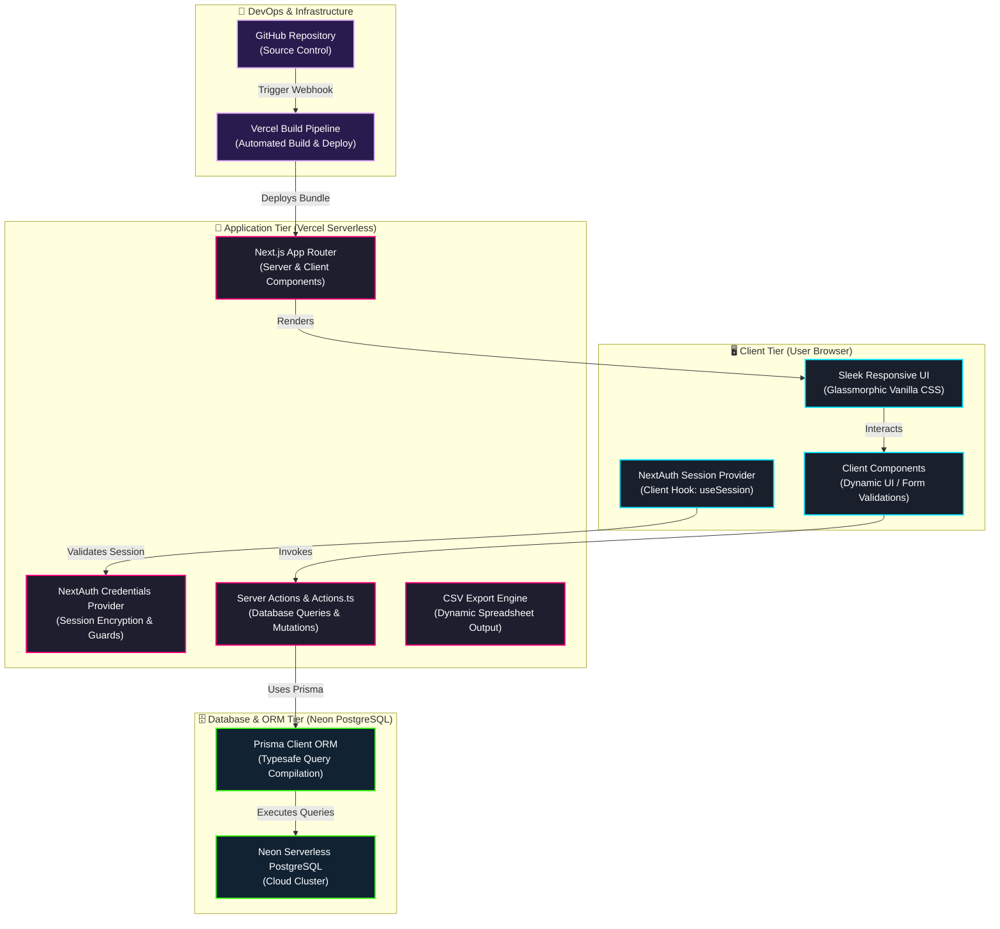
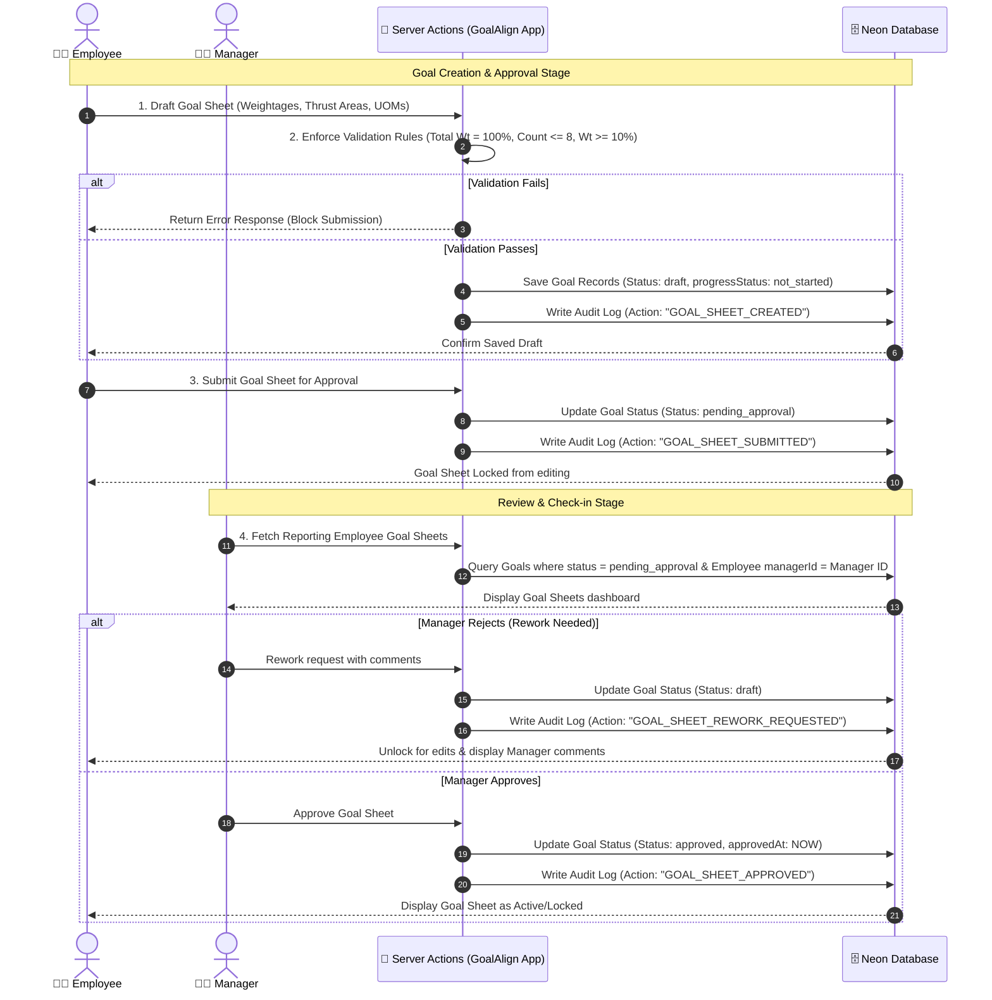
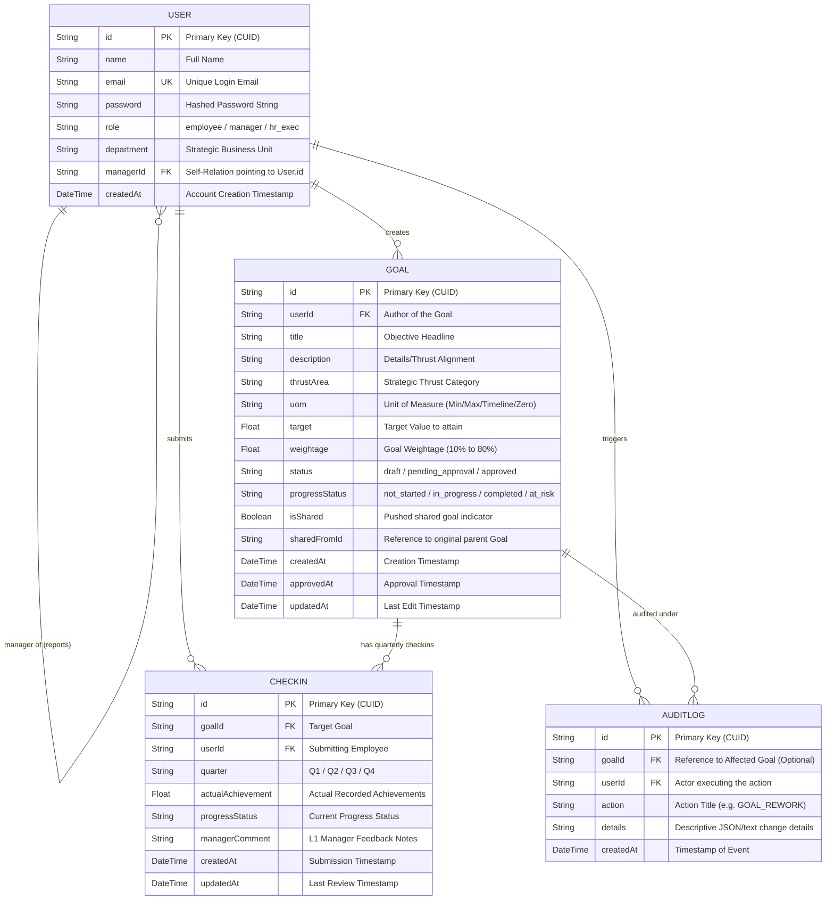

# 🏗️ GoalAlign — System Architecture & Data Flow Design

Welcome to the technical architecture documentation for **GoalAlign**, the premium OKR and performance alignment portal designed for the **Atomberg Hackathon 1.0**. 

This document breaks down the multi-tiered system design, the lifecycle sequencing of Goal Sheets, and the relational database schema supporting our secure serverless infrastructure.

---

## 🖥️ 1. System Component Architecture

GoalAlign is designed on a highly responsive, modern multi-tiered serverless architecture using **Next.js 15**, **Prisma ORM**, and **Neon Serverless PostgreSQL**.

### Architectural Highlights
* **Edge-Optimized Presentation**: The frontend leverages React Server Components (RSC) to minimize Client Bundle size and render static shells instantly.
* **Secured Context Isolation**: User sessions are handled with cryptographically secure JSON Web Tokens (JWT) using `NextAuth.js`, preventing role-privilege escalation at both UI routing and API Server Action layers.
* **Serverless Data Pipeline**: Rather than spinning up resource-intensive traditional server architectures, database operations occur through stateless Next.js Server Actions connecting dynamically to a pooled serverless Neon PostgreSQL database via a lightweight Prisma ORM compilation.

---

## 🔄 2. Goal Sheets Lifecycle & Sequence Flow

This diagram illustrates the sequence of validation, submission, approval, and feedback workflows when an employee creates their OKRs and aligns them with strategic department objectives.

---

## 🗄️ 3. Database Entity-Relationship Diagram (ERD)

The PostgreSQL schema compiled with Prisma enforces structural relationships ensuring high compliance, auditable history, and quick querying speeds.

---

## 🏆 Unstop Submission Copy-Paste Template

> [!TIP]
> Copy the contents below and compile it directly into a PDF/DOCX (or paste into your submission file) to create an extremely professional project delivery package for the Atomberg Hackathon judges!

***

# Project Submission: GoalAlign — Atomberg Goal Tracking Portal

## 🔗 Live Application Link
👉 **[GoalAlign Live Production Web Portal](https://atomberg-hackathon-vo5y08ai0-vishwassachan684-arts-projects.vercel.app)**

## 💻 Source Code Repository
👉 **[GoalAlign GitHub Code Repository](https://github.com/vishwassachan684-art/Atomberg-Hackathon)** *(Contains complete deployment pipeline config, Prisma schema, and customized styling engine)*

---

## 🔑 Judge Login Credentials
To help review the application end-to-end, copy-pasteable judge accounts are available directly inside the secure login terminal:

| Role | Test Account Email | Password | Access Level |
| :--- | :--- | :--- | :--- |
| **Employee** | `arjun@company.com` | `password123` | Drafts goals, check-ins, inputs achievements, runs calculations. |
| **Manager** | `priya@company.com` | `password123` | Reviews reporting sheets, approves/rereoutes goals, writes feedback. |
| **HR / Executive** | `neha@company.com` | `password123` | SBU overview, audit trails, generates CSV compliance spreadsheet. |

---

## 🏗️ Technical Architecture & Key Solutions

### 1. Unified SBU Objective-Goal Alignment
* **Strategic Thrust Areas**: Direct individual-to-corporate alignment mapping (e.g. *Engineering Excellence*, *Product R&D*, *Operational Speed*).
* **Smart Progress Score Algorithm**: Exact dynamic mapping calculations built inside our computation logic to handle modern target definitions automatically:
  * **Min (Higher is better)**: Score = (Actual / Target) * 100
  * **Max (Lower is better)**: Score = (Target / Actual) * 100 if Actual > Target
  * **Timeline (On Time = 100%)**: Standard binary score tracking against time bounds.
  * **Zero Target (Zero is ideal)**: Strict compliance metrics scoring.

### 2. Comprehensive Compliance Engine
* Enforces validation constraints dynamically upon submission: total weightage must exactly sum to **100%**, individual goals weightage must span between **10%** and **80%**, and no employee can exceed a **maximum of 8 goals** per cycle.

### 3. Bulletproof Audit Logs & HR Governance
* Full record persistence documenting state changes, manager actions, rework updates, and timestamps.
* Downloadable CSV data reports containing full SBU-aligned analytics built dynamically via standard client stream triggers.
