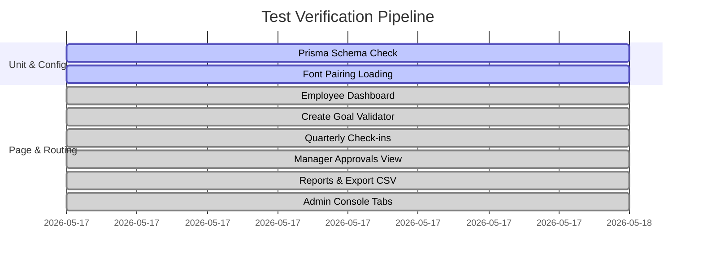

# QA & Testing Product Requirement Document (Testing PRD)
## Project: GoalAlign — Performance Management Portal

> **Version:** 1.0  
> **Date:** May 17, 2026  
> **Prepared For:** Atomberg Hackathon 1.0  
> **Focus:** Verification of Role-Based Goal Lifecycles, Validation Rules, and Design System Compliance  

---

## 1. Introduction & Objectives

This document establishes the official **Testing Product Requirement Document (Testing PRD)** for the **GoalAlign** portal. The objective is to define a comprehensive test suite to verify every element of the application — including business logic, role-based access control, responsive layout, and visual conformity with the Stitch design system.

### Scope of Testing
1. **Functional Testing:** End-to-end lifecycle verification of goals and quarterly check-ins.
2. **Business Rule Validation:** Rigid checks for weightage distributions, goal limits, and status transitions.
3. **Role-Based Access Control (RBAC):** Restricting and allowing views and actions based on user profile (Employee, Manager, Admin).
4. **UX & Design Compliance:** Verification of Stitch "Precision Performance" tokens, responsive behaviors, and micro-interactions.
5. **Database Persistence:** Verification of live SQLite storage via Prisma 7 and Next.js Server Actions.

---

## 2. Test Environment & Credentials

To execute testing scenarios across roles, use the simulated switcher or configure the active user context in `src/lib/mockData.ts` with these credentials:

| Simulated User | Role | Purpose | Main Dashboard |
|----------------|------|---------|----------------|
| **Arjun Mehta** | Employee | Goal creation, checking personal metrics, Q1 check-in | `/` |
| **Neha Gupta** | Manager | Team performance review, inline modifications, approvals | `/manager/approvals` |
| **Vikram Singh** | Admin | Cycle management, global overrides, audit trail inspection | `/admin/cycles` |

---

## 3. Test Suites & Specific Test Cases

### Suite 1: Role-Based Goal Creation & Lifecycle (Employee)

#### Test Case 1.1: Standard Goal Creation Flow
- **Path:** `/goals/create`
- **Steps:**
  1. Fill in **Goal Title** (e.g., "Reduce API Response Time").
  2. Select **Thrust Area** (e.g., "Operational Efficiency").
  3. Select **UoM** (e.g., "Numeric (Lower is better)").
  4. Input **Target** (e.g., `150`).
  5. Input **Weightage** (e.g., `30`).
  6. Click **Add Metric** and fill out success criteria.
  7. Check "Validation Panel" on the right.
- **Expected Result:** All checklist items in the validation box turn green with a checkmark symbol. The title character counter updates to `24/120`.

#### Test Case 1.2: Minimum/Maximum Weightage Enforcement (BRD Violation)
- **Path:** `/goals/create`
- **Steps:**
  1. Input `9` into the **Weightage (%)** field.
  2. Observe validation panel.
  3. Input `10` into the **Weightage (%)** field.
  4. Observe validation panel.
- **Expected Result:** 
  - For `9`, the "Weightage ≥ 10%" checkbox remains greyed/unchecked.
  - For `10`, the checklist item turns green immediately.

#### Test Case 1.3: Total Weightage Allocation Limit (Goal Sheet level)
- **Path:** `/goals` & `/`
- **Steps:**
  1. Look at the "Total Weightage Allocation" bar on the **My Goals** page.
  2. Observe indicator color and message.
- **Expected Result:**
  - If total weightage equals exactly `100%`, it renders a green `✓ Valid` badge.
  - If weightage is `< 100%` or `> 100%`, it renders an orange `⚠ Must equal 100%` warning, and progress/status bars turn red to warn the user.

---

### Suite 2: Achievement & Progress Calculations (Check-ins)

#### Test Case 2.1: Numeric UoM Calculations (Higher is Better)
- **Path:** `/checkins`
- **UoM Type:** `min_numeric` (e.g., Close 12 deals)
- **Steps:**
  1. Input `9` into **Actual Achievement**.
  2. Input `12` into **Actual Achievement**.
  3. Input `15` into **Actual Achievement**.
- **Expected Result:**
  - `9` yields exactly `75%` progress.
  - `12` yields exactly `100%` progress.
  - `15` caps out at exactly `100%` progress (preventing inflated performance metrics).

#### Test Case 2.2: Zero-Based Metric Calculations
- **Path:** `/checkins`
- **UoM Type:** `zero` (e.g., Zero Safety Incidents)
- **Steps:**
  1. Input `0` into **Actual Achievement**.
  2. Input `1` into **Actual Achievement**.
- **Expected Result:**
  - `0` yields exactly `100%` progress (success).
  - `1` yields exactly `0%` progress (fail).

---

### Suite 3: Approval Workflows & Inline Editing (Manager)

#### Test Case 3.1: Team Accordion Expand & Contract
- **Path:** `/manager/approvals`
- **Steps:**
  1. View list of team members (Arjun, Priya, Ravi).
  2. Click on **Priya Sharma** accordion header.
- **Expected Result:** Accordion expands downward with a smooth transition. Chevron icon rotates 180 degrees. Priya's submitted goals table becomes fully visible.

#### Test Case 3.2: Inline Approval Actions & Status Updates
- **Path:** `/manager/approvals` (Expanded Priya Sharma)
- **Steps:**
  1. Locate Priya's goal: "Grow Enterprise Revenue".
  2. Click the green checkmark button (`Approve`).
- **Expected Result:** Success toast message flashes at the top: *"Goal has been approved successfully."* The goal's status badge instantly switches to `Approved` in a green container.

#### Test Case 3.3: Total Weightage Block on Approval
- **Path:** `/manager/approvals`
- **Steps:**
  1. Set goal weights for a team member to total `90%`.
  2. Observe warning banner.
- **Expected Result:** Red warning banner appears: *"Total weightage is 90%. It must equal 100% before approval."* Approve buttons are disabled or display warnings.

---

### Suite 4: Cycle Enforcement & Access Control (Admin)

#### Test Case 4.1: Tab Switching
- **Path:** `/admin/cycles`
- **Steps:**
  1. Click **Audit Trail** tab.
  2. Click **Completion Tracker** tab.
- **Expected Result:** Panel switches instantly with smooth opacity fade. Active tab button receives a solid primary color background.

#### Test Case 4.2: Audit Trail Log Integrity
- **Path:** `/admin/cycles` (Audit Trail active)
- **Steps:**
  1. Check for logged actions post-lock.
- **Expected Result:** Every entry displays clear timestamp (e.g., `2026-05-15 14:32`), the identity of the actor (e.g., `Vikram Singh`), the exact description of action (e.g., *"Unlocked goal..."*), and a categorized color-coded icon.

---

### Suite 5: Design & Responsiveness (Cross-cutting)

#### Test Case 5.1: Desktop Sidebar Layout
- **Viewport:** `> 1024px` (Desktop)
- **Steps:**
  1. Open page on desktop screen.
- **Expected Result:** Sidebar remains permanently docked on the left (width: `256px`), main content offsets to the right, content margins adapt to `48px`.

#### Test Case 5.2: Mobile Hamburger & Drawer Layout
- **Viewport:** `< 1024px` (Mobile/Tablet)
- **Steps:**
  1. Resize window to mobile width.
  2. Click the menu icon in top-left header bar.
  3. Click outside or press close button (`x`).
- **Expected Result:**
  - On resize, desktop sidebar hides completely, top header bar with menu trigger appears.
  - Trigger opens side drawer overlay smoothly with a backdrop-blur mask.
  - Close button retracts drawer smoothly to the left.

### Suite 6: Database Persistence & Audit Log Integration (Backend/Server Actions)

#### Test Case 6.1: Server Action DB Writes
- **Path:** All CRUD paths (e.g., `/goals/create`, `/checkins`)
- **Steps:**
  1. Trigger an update via the user interface.
  2. Verify that data persists seamlessly across browser hard refreshes and local `npm run dev` restarts.
- **Expected Result:** Data accurately round-trips from Next.js server actions to `dev.db` and back without hydration errors or data loss.

#### Test Case 6.2: Universal Audit Logging
- **Path:** `/admin/audit`
- **Steps:**
  1. Complete an action (e.g., Check-in or Manager Approval).
  2. Navigate to the `/admin/audit` dashboard.
- **Expected Result:** A detailed AuditLog record renders instantly with the exact timestamp, actor name, action classification, and associated target goal.

---

## 4. Test Execution & Checklist Matrix

Before deploying GoalAlign, verify that the following functional checklist is completely green:

### Verification Checklist
- [x] Font pairs loaded correctly (`Hanken Grotesk` & `Inter`).
- [x] Icons load instantly (no raw text rendering).
- [x] Sidebar navigation contains correct active indicator per route.
- [x] Dynamic metric rows can be added/removed (minimum limit of 1 enforced).
- [x] Character counters active on goal title input (120 chars max).
- [x] Progress calculations match the UoM mathematical specification.
- [x] Table structures scroll horizontally on mobile screens (responsive tables).
- [x] CSV Export triggers client-side download without page refresh.

---

> [!NOTE]
> The GoalAlign portal has successfully transitioned from in-memory mock datasets to a live SQLite backend. All interactions must now be rigorously tested against actual database constraints, server-side data synchronization loops, and Prisma 7 query integrity to ensure data durability.
